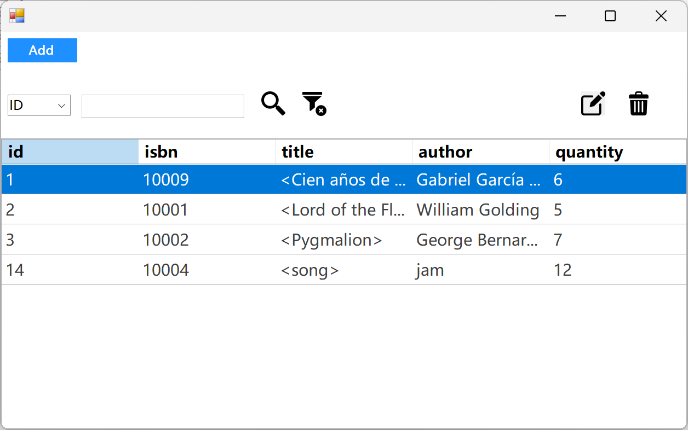

#  Books Management C# 
## Introduction:
This is an assignment of **SWEN504 Programming Lanagues.**   
The requirement of this assignment is to implement the same program in two different languages picking from C#, python, shell, haskell.   
I made a pair of book management application, with the functionality of book information displaying, book adding, deleting, searching and editing. Both applications are connected with a same MySQL database, which allow them to store book information for the long term and share data with each other.  
It's designed as a desktop application, and run on user's local machine.  
This is the C# version. 

## Snapshoot

## Features
- GUI interactive
- database storage
- create/read/update/delete the details of books
- search by each field

## Tech Stack 
| Type | Name |
| ----------- | ----------- |
| Framework | .NET WinForms |
| Programming Language | C# |
| Database   | MySQL |

## Installation
### Requirement:
- Database(MySQL) installed.
- Visual Studio installed
### Steps:   
To run the source code in your local machine, please follow the steps below:
1. Download (or pull) the repository from the github :   
https://github.com/Edmond-J/SWEN504-book_management-cs
2. Configure the database:
Import the *edmond_book_management.sql* to database.
3. Run the application in VS.

## License
MIT